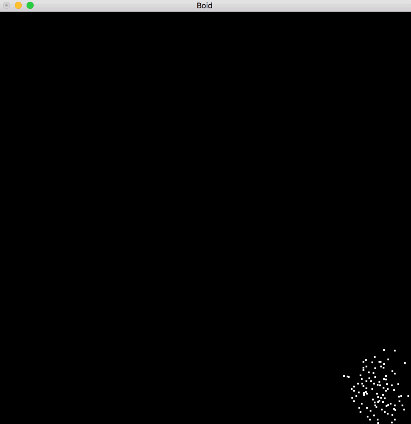

# Boid simulation by Yampa in Haskell


## What's boid?

Boid is a program which simulates the flocking behaviour of birds.
Boid is based on simple 3 rules as follows.

* Separation
 - steer to avoid crowding local flockmates
* Alignment
 - steer towards the average heading of local flockmates
* Cohesion
 - steer to move toward the average position (center of mass) of local flockmates

 (from: https://www.wikiwand.com/en/Boids)


## Main features

* Yampa - A functional reactive programming library
* GLUT  - The OpenGL Utility Toolkit


## How to run


```sh
$ stack build --exec boid-exe
```

## Demo



This boid is a swarm of flies rather than a flocking of birds :D

(This program is based on http://otatin.com/static/www/simple-boids/ (JavaScript))
